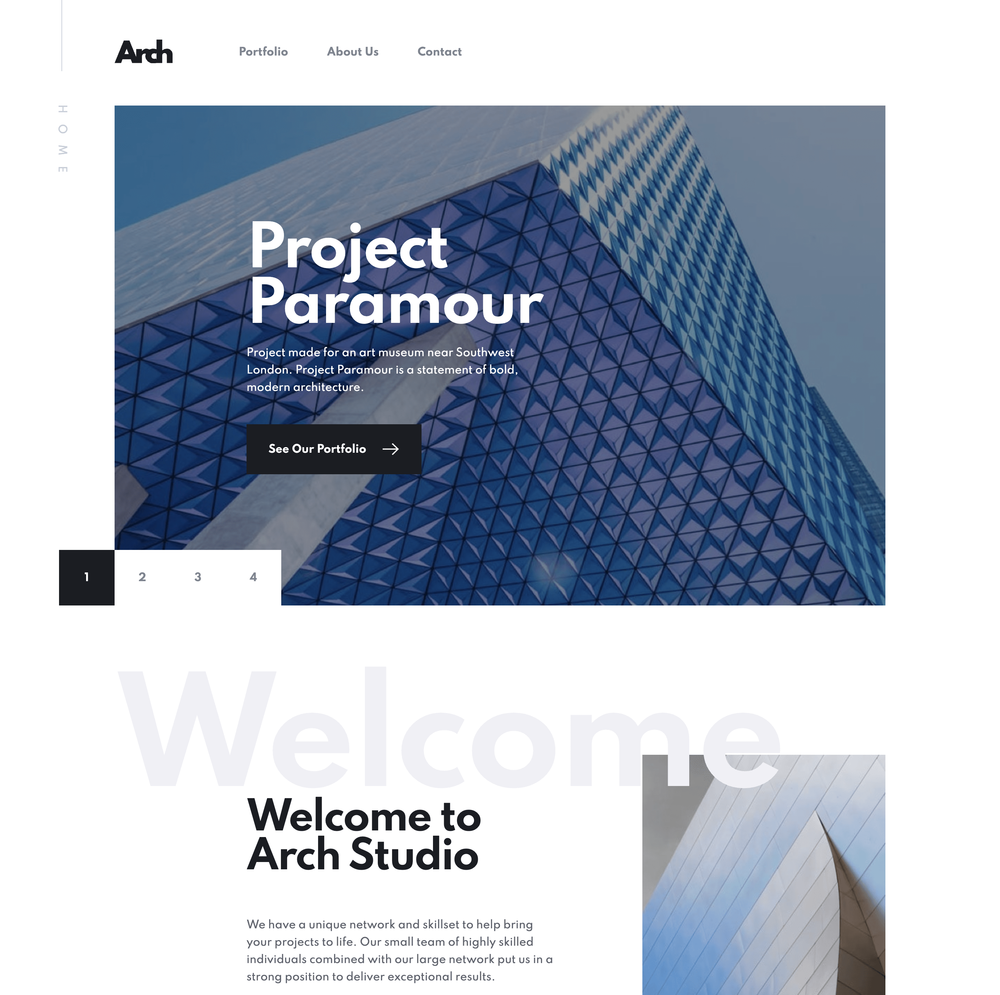

# Arch Studio

A 4 pages website for a fictional architecture agency

## Hi ! 👋

**Thanks for checking out this [project](https://github.com/davidyvon/arch-studio-website) !**

## General info

- Mobile First Responsive Design
- Mobile menu
- Slideshow
- Portfolio
- Form with data validation

## Built with

      

## Want to see more ?

**Check out my [portfolio](https://www.davidyvon.com) !**
